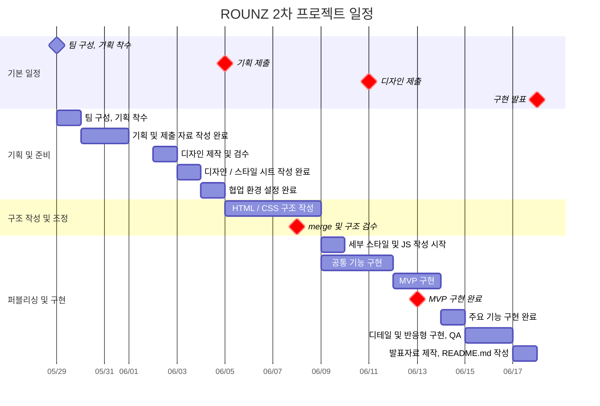

# 오르미 안경점 : ROUNZ (2차 프로젝트)

- 과정명: 프론트엔드 13기 개발자 양성(Figma)
- 기간: 2026/04/07 ~ 2026/08/21
- 2차 프로젝트: 2026/05/29 ~ 2026/06/18
- ROUNZ 사이트 리뉴얼을 주제로 한 HTML/CSS/JavaScript 기반 반응형 웹 프로젝트입니다.

## 0. 작업 전 확인

### 🔗 빠른 링크

작업자는 아래 문서를 먼저 확인합니다.

1. [개발 컨벤션](./docs/convention.md)
2. [AI 작업 하네스](./docs/ai-harness.md)
3. [작업 요청 템플릿](./docs/task-template.md)
4. [QA 체크리스트](./docs/qa-checklist.md)
5. [5팀 개발 컨벤션](https://app.notion.com/p/oreumi/5-36febaa8982b8066875ec4d2162785e0?source=copy_link)
6. [기획서(피그마 슬라이드)](https://www.figma.com/slides/FhyEJe6nHTMdpvdEKmmlVE)
7. [디자인 원본(피그마)](https://www.figma.com/design/0ZgyWF5d6fhEFIU3MJ2ife/rounz-%EB%A0%88%ED%8D%BC%EB%9F%B0%EC%8A%A4-%EB%B6%84%EC%84%9D-%EB%B0%8F-%EB%94%94%EC%9E%90%EC%9D%B8?node-id=283-2&t=GBQ8OeKSfN4QywKd-1)

### 핵심 규칙

- `main` 브랜치와 `deploy` 브랜치에 직접 push하지 않습니다.
- 작업은 `feat/`, `fix/`, `refactor/`, `chore/` 브랜치에서 진행합니다.
- HTML에는 `css/style.css` 하나만 연결합니다.
- `css/style.css`와 `css/style.css.map`은 직접 수정하지 않습니다.
- 스타일 수정은 `scss/` 하위 파일에서 진행합니다.
- 공통 기능을 수정하기 전에는 담당자 또는 팀원에게 공유합니다.

## 기본 작업 흐름

```txt
개별 브랜치 생성 → 작업 → 자체 QA → PR 생성 → 코드 리뷰 → main 병합 → 안정화 후 deploy 반영
```

## 주요 문서 역할

| 파일                               | 역할                                               |
| ---------------------------------- | -------------------------------------------------- |
| `docs/convention.md`               | 사람이 읽는 개발 컨벤션, 파일 구조, 작성 규칙      |
| `docs/ai-harness.md`               | AI 작업 시 수정 범위와 금지 규칙을 제한하는 하네스 |
| `docs/task-template.md`            | AI 또는 팀원에게 작업을 요청할 때 쓰는 양식        |
| `docs/qa-checklist.md`             | 구현 완료 후 확인해야 할 검수 기준                 |
| `.github/pull_request_template.md` | PR 작성 시 컨벤션 준수 여부 확인                   |

## 1. 프로젝트 개요

### 1.1 목표

- **실제 사이트 리뉴얼 경험**: 기존 교육 플랫폼의 UI/UX 및 정보 구조 개선
- ㅇ
- ㅇ
- ㅇ

### 1.2 👥 팀원

| 이름   | 역할   | 주요 담당 | GitHub                                 | 연락               |
| ------ | ------ | --------- | -------------------------------------- | ------------------ |
| 김찬희 | 팀장   |            | [@ckck912ck-lang](https://github.com/ckck912ck-lang) |ckck912ck@gmail.com |
| 배정호 | 팀원   | 깃허브 배포, 개발 컨벤션 작성| [@raspbsb](https://github.com/raspbsb) | unionbjh@naver.com |
| 조승아 | 팀원   | 회의록 작성| [@eodrn7021-cell](https://github.com/eodrn7021-cell) | eodrn7021@gmail.com |
| 박은수 | 팀원   |QA 작성| [@jond0803]https://github.com/jond0803)|                    |
| 주성문 | 팀원   |             | [@KimShueBang](https://github.com/KimShueBang) | enforhssh@gmail.com |

### 1.3 🗓️ 마일스톤

#### 1주차 — 기획/디자인 및 퍼블리싱 준비

- [ ] 프로젝트 주제 및 리뉴얼 방향성 정의
- [ ] 기존 사이트 현황 및 문제점 분석
- [ ] 사용자 흐름과 핵심 목적 정리
- [ ] 레퍼런스 사이트 조사 및 벤치마킹
- [ ] MVP 기능 범위 정의
- [ ] 정보 구조 및 페이지 구성 정리
- [ ] 메인 페이지 구성안 기획
- [ ] 기획 자료 제작
- [ ] 기획 제출 및 피드백 정리
- [ ] 스타일 가이드 및 디자인 방향 설정
- [ ] 와이어프레임 제작
- [ ] 공통 UI 구조 설계
- [ ] 상품 목록/상세/장바구니 등 주요 페이지 디자인 작업
- [ ] UI 컴포넌트 디자인
- [ ] 이미지 관리 규칙 정리
- [ ] 폴더 구조 및 파일 네이밍 규칙 확정
- [ ] GitHub 협업 환경 설정
- [ ] 커밋/브랜치/PR 규칙 정리
- [ ] 디자인 제출 및 피드백 반영

#### 2주차 — 구조 작성 및 조정

- [ ] HTML 기본 구조 작성
- [ ] SCSS 기본 구조 작성
- [ ] 공통 레이아웃 구현
- [ ] 헤더/푸터/내비게이션 구현
- [ ] 공통 컴포넌트 제작
- [ ] 메인 페이지 퍼블리싱
- [ ] 상품 목록 페이지 퍼블리싱
- [ ] 상품 상세 페이지 퍼블리싱
- [ ] 장바구니 페이지 퍼블리싱
- [ ] 로그인/회원가입 페이지 퍼블리싱
- [ ] fetch 기반 상품 데이터 렌더링 구현
- [ ] 상품 필터/정렬 기능 구현
- [ ] localStorage 기반 장바구니 기능 구현
- [ ] 탭/캐러셀/모달 등 인터랙션 구현
- [ ] 반응형 스타일 적용

#### 3주차 — 퍼블리싱

- [ ] 페이지별 UI 최종 점검
- [ ] 반응형 화면 검수
- [ ] 기능 동작 테스트
- [ ] 브라우저별 기본 확인
- [ ] HTML/CSS/JS 코드 리팩토링
- [ ] 중복 스타일 및 중복 코드 정리
- [ ] 접근성 기본 속성 점검
- [ ] README.md 작성
- [ ] GitHub Pages 배포
- [ ] 발표 자료 작성
- [ ] 발표 준비
- [ ] 최종 발표



## 2. 개발 환경 및 배포

### 2.1 개발 스택

#### Frontend

- **Language**: javaScript
- **Styling**: CSS/scss

#### Tools

- **Version Control**: Git & GitHub
- **Design**: Figma
- **Editor**: VS Code
- **Code Formatter**: Prettier
- **SCSS Compiler**: Live Sass Compiler (VS Code Extension)

### 2.2 배포 URL

- **Production**: 링크

### 2.3 📚 개발 컨벤션 가이드

프로젝트에서 사용하는 HTML, CSS, JavaScript 작성 규칙은 아래 문서를 참고하세요.

- [HTML 컨벤션](<[--](--)>)
- [CSS 컨벤션](<[--](--)>)
- [javascript 컨벤션](<[--](--)>)
- [version control 컨벤션](<[--](--)>)
- [기타 개발 관련 규칙](<[--](--)>)

---

## 3. 프로젝트 구조

```

est_fe_13_2st_project/
│
├─ index.html : 메인 페이지
├─ product-list.html : 상품 목록 페이지
├─ product-detail.html : 상품 상세 페이지
├─ cart.html : 장바구니 페이지
├─ login.html : 로그인 페이지
├─ signup.html : 회원가입 페이지
│
├─ assets/
│ ├─ images/
│ │ ├─ common/ : 공통 이미지 (로고/기본 배경/공통 UI 이미지 등)
│ │ ├─ banner/ : 메인 배너, 이벤트 배너 등 프로모션 이미지
│ │ └─ products/ : 상품 썸네일, 상품 상세 이미지 등 상품 관련 이미지
│ ├─ icons/
│ └─ videos/
│
├─ data/
│ ├─ notice.json
│ ├─ qna.json
│ └─ products.json
│
├─ css/
│ ├─ style.css : 스타일 메인 파일 (style.scss에서 이 파일로 컴파일)
│ └─ style.css.map
│
├─ scss/
│ ├─ base/
│ │ ├─ \_variables.scss : css변수 모음
│ │ ├─ \_mixins.scss : 자주 쓰는 스타일 조각 모음
│ │ ├─ \_typography.scss : @font-face 모음
│ │ ├─ \_reset.scss : 기본 스타일 제거
│ │ └─ \_normalize.scss : 브라우저 차이 통일
│ │
│ ├─ layout/
│ │ ├─ \_common.scss : 공통 레이아웃 (컨테이너 너비, 섹션 상하패딩 등)
│ │ ├─ \_header.scss : 헤더 모듈
│ │ ├─ \_footer.scss : 푸터 모듈
│ │ └─ \_navigation.scss : 내비게이션 모듈
│ │
│ ├─ components/
│ │ ├─ \_button.scss : 공통 버튼 컴포넌트
│ │ ├─ \_card.scss : 공통 카드 컴포넌트
│ │ ├─ \_tabs.scss : 공통 탭 컴포넌트
│ │ ├─ \_carousel.scss : 공통 캐러셀(자동 슬라이드) 컴포넌트
│ │ ├─ \_filter.scss : 공통 필터 컴포넌트
│ │ ├─ \_modal.scss : 공통 모달(팝업창 등) 컴포넌트
│ │ └─ \_form.scss : 공통 폼 컴포넌트
│ │
│ ├─ pages/
│ │ ├─ \_index.scss : 메인 페이지 세부 스타일
│ │ ├─ \_product-list.scss : 상품 목록 페이지 세부 스타일
│ │ ├─ \_product-detail.scss : 상품 상세 페이지 세부 스타일
│ │ ├─ \_cart.scss : 장바구니 페이지 세부 스타일
│ │ ├─ \_login.scss : 로그인 페이지 세부 스타일
│ │ └─ \_signup.scss : 회원가입 페이지 세부 스타일
│ │
│ └─ style.scss : 모든 scss 파일을 불러와 style.css로 컴파일
│
├─ js/
│ ├─ utils/ : 여러 파일에서 공통으로 사용하는 작은 기능 함수 모음
│ │ ├─ dom.js : selector 유틸 등 DOM 관련 자주 반복되는 함수
│ │ └─ format.js : 가격 등 데이터를 화면에 표시하기 좋게 변환하는 함수
│ │
│ ├─ modules/ : 여러 페이지에서 재사용 가능한 코드
│ │ ├─ menuToggle.js : 모바일 메뉴 열기/닫기, 햄버거 버튼, dim 처리
│ │ ├─ carousel.js : 배너/상품 슬라이드 등 움직이는 캐러셀 기능
│ │ ├─ tabs.js : 공지/이벤트 탭 등 탭 전환 UI
│ │ ├─ products.js : 상품 데이터를 필터링/정렬하고 상품 카드를 렌더링
│ │ └─ cartManager.js : localStorage 장바구니 추가/삭제/수량 변경
│ │
│ └─ pages/ : 특정 HTML 페이지에서만 실행되는 조립 코드
│ ├─ main.js : 모든 페이지 공통 실행 코드
│ ├─ index.js : index.html에서만 필요한 코드
│ ├─ productList.js : product-list.html에서만 필요한 코드
│ ├─ productDetail.js : product-detail.html에서만 필요한 코드
│ ├─ cart.js : cart.html에서만 필요한 코드
│ ├─ login.js : login.html에서만 필요한 코드
│ └─ signup.js : signup.html에서만 필요한 코드
│
├─ .gitignore : 일부 파일 Github 업로드 무시
└─ README.md

```

## 4. 향후 개선 사항

- ㅇ
- ㅇ
- ㅇ
- ㅇ
- ㅇ

## 5. 제작 후기

ㅇ

## 6. 기획/디자인 문서

- **기획서(피그마 슬라이드)**: 사용자 흐름 설계, 리뉴얼 방향성, 스타일 가이드, 개발 기준 및 주요 구현 내용
  링크: ㅇ
- **디자인 원본(피그마)**: 컴포넌트, 컬러/타이포 스케일, 반응형 레이아웃, 아이콘
  링크: ㅇ

### 7. 미리보기

<!-- /public/readme/ 폴더에 썸네일 PNG를 넣고 경로를 맞춘다 -->

[](링크 "피그마 슬라이드로 이동")
[](링크 "피그마 디자인으로 이동")

```

```
